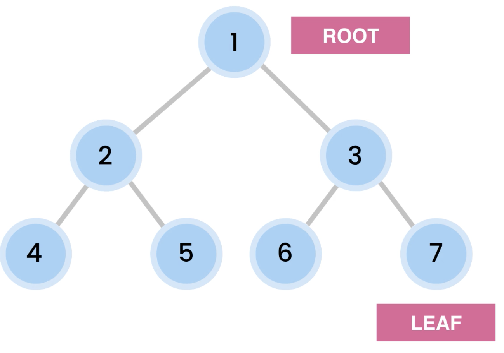
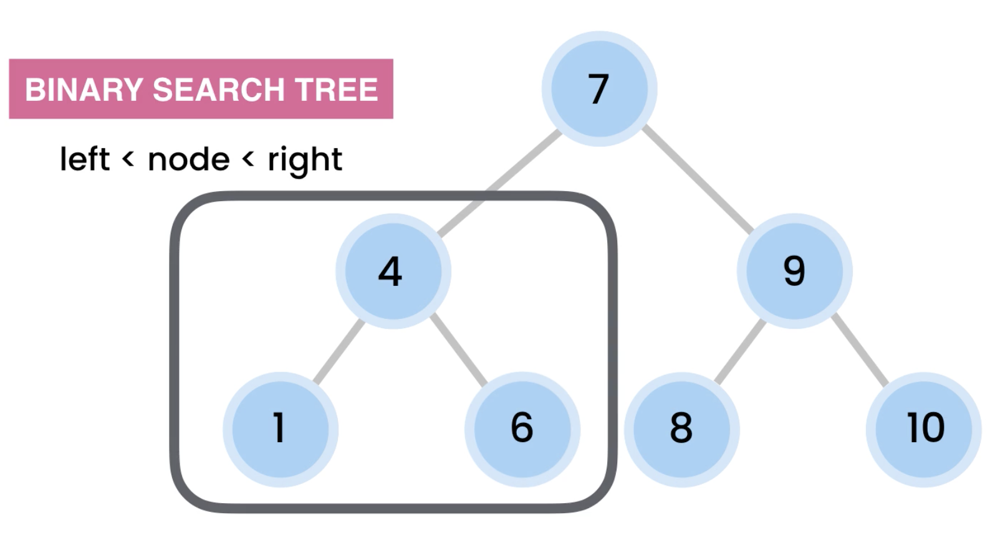

# Data Structure and Algorithms

I will cover as follow DS:

Linear DS
- Arrays
- Linked List
- Stacks
- Queues
- Hast Tables

Unlinear DS
- Trees
- Graphs

## Big O Notation

We use a big O notation to describe the performance of an algorithm O(n) (run time complexity).

- constant O(1)
- logarithmic O(log n)
- linear O(n)
- quadratic O(n^2)
- exponential O(2^n)

We also have space complexity

## Arrays

We use it to store list of items seqentially.

Arrays are static! It has fix size.

- lookup by index O(1)
- lookup by value O(n)
- insert O(n) > if we increase a size we have to copy all items into a new one
- delete O(n) > if we delete the first item all the rest items must be shifted to the left
- delete O(1) > if we delete the last item but in big O Notation we have to take the worst case  scenario (not the best one like here)

We have two types of dynamic arrays:

- Vector which grows 100% and it is synchronized
- ArrayList which grows 50% and it is NOT synchronized

We cannot use Vector for multi-thread application because it is synchronized instead we can use the ArrayList!!

## LinkedList

We use LinkedList to store list of object in sequence but inlike arrays LinkedList can grow shrink automatically.
LinkedList consists of a group of nodes in squence. Each node holds two pieces of data. One is a value and the other is
the address of the next node. We call the first node as head and the last one tail.

Time of complexity:

- Lookup O(n)
- By index O(n)
- Insert
	- At the end O(1)
	- At the beginning O(1)
	- At the middle O(n)
- Delete
	- From the end O(n)
	- From the beginning O(1)
	- From the middle O(n)

## Arrays vs LinkedList

- Static arrays have fixed size
- Dynamic arrays grow by 50-100%
- LinkedList do not waste memory (but takes a bit memory as it stores value and the pointer to the next node)
- Use arrays if you know the number of items to store
- We can set initial size in arrayList like new ArrayList(100)

## STACKS

We use stack when we want to:

- Implement the undo feature
- Build compilers (eg syntax checking)
- Evaluate expressions (eg 1 + 2 * 3)
- Build navigation (eg forward/back)

It is LIFO (Last In, First Out)

Operations:
- push(item)  > O(1)
- pop()       > O(1)
- peek()      > O(1)
- isEmpty()   > O(1)

## Queues

Used in:
- printers
- OS for managing processes
- Web servers for managin incoming requests
- Live support systems
Basically anywhere where we need to process jobs based on the order we receive them.

it is FIFO.

Operations:

- enqueue for adding an item to the back in the queue
- dequeue for removing an item at the front of the queue
- peek for getting an item from the front without removining it
- isEmpty
- isFull

All the above operations are O(1).

## Hash Tables

Also called dictionaries. Hast Tables give us a super fast look ups and we can
use them to optimize a lot of algorithms. 

We use them in:

- Spell checkers as we can quickly look up a word amongst tens of thousands of
words in less then a second.
- Building a dictionaries
- Compilers for looking up address of functions and variables.
- Code editors

Literally everywhere we need to look up an item super fast.

- HashMap > JAVA
- Object > JavaScript
- Dictionary > Python & C#

We use hash tables to store key value pairs.

Eg:

We want to store employee under the employeeNumber
- key = employNumber
- value = employee

employNumber --> Hash Function --> address of the memory

Our hash table takes the employNumber, passes it to what we call hash function
and this hast function will tell where the employee object should be stored
in memory.

The hash function is DETERMINISTIC which means every time we give it the same
input it will return the same value.

Time complexity:
- Insert O(1)
- Lookup O(1)
- Delete O(1)

## Binary Tree

A tree is a data structure that stores elements in a hierarchy. We refer to these
elements as nodes and the lines that connect them as edges. Each node contains
a value or data.

A binary tree has maximum of two children.

Usage of trees:

- Represent hierarchical data
- Databases
- Autocompletion
- Compilers
- Compression (JPEG, MP3)

Time complexity

- Lookup O(log n)
- Insert O(log n)
- Delete O(log n) 

### Traversing a tree

We have two options:

- Breadth first (level order traversal): Visit the nodes at the same level level
before visiting nodes at the next level. We start at the root level 7, then 4, 9
and then 1, 6, 8, 10
- Depth first:
    - Pre-order     Root, Left subtree, Right subtree
    - In-order      Left, Root, Right
    - Post-order    Left, Right Root

We also have:

- Depth (Starts from root to the leafs)
- Height (Starts from the leafs to the root)

